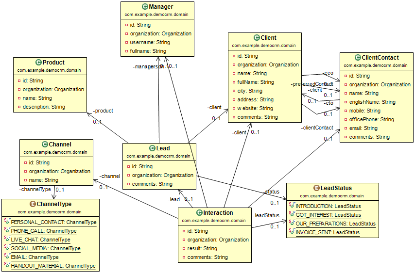

# CRM Demo

This is demo software, not ready for production, but enough to showcast ideas and practices.

Read this README carefully, look into /docs folder for diagrams, check the code.

## Domain Intro

In context of CRM Lead is potential sale.
Sales are views as pipeline of interaction with potential buyer,
passing though phases of Attention -> Interest -> Desire -> Action (AIDA)
- introduction of company, products
- checking what product may interest
- confirming on parameters
- actual sale preparation

Sales almost never happens on the first one phone call.
It is more about building relations.   
Sending a an e-mail with news announce, may be a start for next week phone call.
But information about whether potential client has opened email is important.

Following "Eating your own dog food" principal, let's create a CRM to sell ERP systems.

Instead of making sales people to enter contacting information into system,
it is better if system would be used to actually make a contact, e.g. dialing a number, sending email.

With online CRM, public information such as company list in a industry sector or a region, can be conveniently available to all CRM clients.

Implementation of CRM can be driven by top managers or by users. Different initial UI should be for these 2 cases.

If starting new CRM PaaS product, it should be treaded as start-up focused on new clients needs
 and the most lean implementation, to provide cost effective cloud solution.

# Implementation ideas

Layers: domain/business layer, service, web

## Software stack

This demo uses Spring projects https://spring.io/ like

- Spring framework
- Spring Data (similar API for relational and NoSQL databases)
- Spring MVC (web)
- Spring Security (cross cutting security concerns)
- Spring Boot (one runnable uber jar, runtime metrics and configuration)
- embedded Tomcat as servlet container
- Spring Session (to keep session out of Tomcat into Redis)
- logback (newest and fast slf4j implementation)
- jackson (JSON library)

Redis in-memory sessions for scaling computing part.

MongoDB with dynamic schemas for more flexible data structures.

## Multitenancy

In this demo a field called `organization` (of type `Organization`) is used to separate tenants data.
This is MongoDB shard key.

There is also idea that some shared data like phones book, yellow pages could benefit all tenants.

Other option would be database per tenant. But that would create complexity of managing those databases.

# Running

1. start local MongoDB and Redis at default ports. Redis starts with --protected-mode no

	docker run -p 27017:27017 mongo
	docker run -p 6379:6379 redis 

or

	mongod --port 27017 --dbpath D:\Workspaces\workspace-sts-3.7.0.RELEASE\com.example.democrm\db
	
2. Run `com.example.democrm.DemoCrmApplication` from within IDE as Java Application

or

	mvn package
	java -jar target/com.example.democrm-0.0.1-SNAPSHOT.jar
	
3. Open browser http://localhost:8080/ , login as user user with password password.

4. Try sending JSON request to http://localhost:8080/leads using tools like POSTMAN or curl	 	
	
# Developing 

Use Mongo and redis consoles

from `redis-cli -p 6379` console
run `keys *` to see list of all keys

## TODO

- [ ] Authentication from MongodDB User collection
- [ ] service layer that would apply filter by user organization
  

	